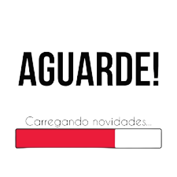

# NodeJs

# Observações importandes

Para execultar o projeto é com o nodemo siga os seguintes passos.

<ol>
<li>yarn init => inicia o projeto</li>
<li>yarn add express --save => instalar o express</li>
<li>yarn add nodemon -D => instala o nodemon</li>
<li>No arquivo package.json acressente as seguintes linhas:
    

        
     "scripts": {
    "test": "echo \"Error: no test specified\" && exit 1",
    "start": "nodemon index.js"
    }

    
</li>
<li>yarn start => para rodar o projeto</li>

</ol>

# Mysql: conectando ao servidor

<ol>
    <li>mysql -h localhost -u root -p</li>
    <li>Enter password: *******</li>
    <li>SHOW DATABASES; => mostra todos os bancos de dados</li>
</ol>

# Mysql: criando um banco de dados e acessando
<ol>
    <li>CREATE DATABASE nome_do_banco;</li>
    <li>USE nome_do_banco;</li>
    <li>SHOW TABLES; => mostras todas as tabelas</li>
    <li>
        

            CREATE TABLE usuarios( 
                nome VARCHAR(50), 
                email VARCHAR(100), 
                idade INT 
            );
        

    </li>
    <li>DESCRIBE nome_da_tabela; => mostra as descrições da tabela</li>
    <li>
    Insere valores na tabela
    

    INSERT INTO usuarios(nome, email, idade) VALUES(
    "Jeovane dos Santos",
    "jeovane@gmail.com",
    8
);
    

    </li>
    <li>SELECT * FROM ususuarios; => seleciona todos os usarios</li>
    <li>SELECT * FROM usuarios WHERE chave (=,=>,=<) valor_da_chave; Lista usuarios expecificos</li>
    <li>DELETE FROM usuarios WHERE chave = valor_da_chave => apaga um dado expecifico</li>
    <li>UPDATE usuarios SET chave = valor_novo WHERE chave = valor_antigo</li>
    
</ol>

# FERRAMENTAS

<ol>
<li>yarn add sequelize</li>
<li>yarn add mysql2</li>
<li>yarn add dotenv</li>
<li>const dotenv = require('dotenv/config')

Para poder usar o process.env.PASWORD que estara dentro do seu arquivo .env

</li>

</ol>

# PRIMEIRO PROJETO, FERRAMENTAS NECESSARIAS E DICAS

<ol>
    <li>Criar projeto, seguindo o passo a passo que está no inicio deste artigo.</li>
    <li>yarn add express-handlebars</li>
    <li>yarn add body-parser --save</li>
    <li>
        

            Ao criar o arquivo Db.js chame o const dotenv = require('dotenv').config(), enves dê,
            const dotenv = require('dotenv/config')
        

    </li>
    <li>No lugar de Post.all() substitua por Post.find()</li>
    <li>Substitua Post.find().then(function(posts) {
         res.render('layout/home', { posts: posts })
     })
     por
     Post.find().then(posts => {
        res.render('layout/home', {
            posts: posts.map(post => post.toJSON())
        })
    })
     </li>
</ol>

# MONGODB

<ol>
    <li>mongod --> coloque esse comando no cmd para roda o servidor do mongo</li>
    <li>mongo --> coloque esse comando no cmd para roda o o mongo</li>
    <li>show collections; --> exibe todas as collection(documentos)</li>
    <li>yarn add mongoose -->instala o mongoose</li>
    <li>show databases; --> mostra todos os bancos de dados</li>
    <li>use nome_do_banco --> acessa um banco</li>
    <li>Dica: se estiver usando um versão do mongo assima do 5, não é mais necessário usar o useMongoClient: true.</li>
    <li>db.nome_da_collection.find(); --> ver os dados salvos</li>
</ol>

# Projeto final

<ol>
    <li>Criar uma pasta e abrir no vscode</li>
    <li>No terminal digite yarn init</li>
    <li>yarn</li>
    <li>yarn add express --save</li>
    <li> yarn add express-handlebars --save</li>
    <li>yarn add body-parser --save</li>
    <li>yarn add mongoose --save</li>
    <li>yarn add express-session --save</li>
    <li>yarn add connect-flash --save</li>
    <li>categoria: categoria substitua por categoria: categoria.toJSON() pois deve converter para json</li>
    <li>Para altera devese passar o id <form action="/admin/categorias/edit/{{categoria._id}}" method="POST">
     para que 

            
     router.post("/categorias/edit/:id", async(req, res) => {

        try {
            const id = req.params.id;
            const c = req.body;
            console.log(c)
            const respo = await Categorias.findByIdAndUpdate(id, c)
            console.log("ok")
            res.redirect("/admin/categorias")
        } catch (err) {
            console.log("Erro " + err)
        }
   
       }) 
        
está rota funcione
</li>
<li><a href="https://www.youtube.com/watch?v=9eWnkkg9Qy8">Video que pode pasar melhor a ideia tomada.</a></li>

<li>
        Se acontecer este erro...
        
 (node:14948) [MONGODB DRIVER] Warning: collection.remove is deprecated. Use deleteOne, deleteMany, or bulkWrite instead.
            (Use `node --trace-warnings ...` to show where the warning was created)

 é porque a forma de excluir que foi utilizada está obsoleta no mongo.
        Então troque por...

    
            <form action="/admin/postagens/deletar" method="POST">
            
                <input type="hidden" name="id" value="{{_id}}">
                <button type="submit">Deletar</button>

            </form>

    
    
</li>
<li>
e na sua rota coloque...

            
        router.post("/postagem/deletar", (req, res) => {
            Postagens.remove({ _id: req.body.id }).then(() => {

                console.log("Deletado com sucesso")
                res.redirect("/admin/postagens")
            }).catch((err) => {
                console.log("Deletado falho")
                res.redirect("/admin/postagens")
            })
        })

</li>

</ol>

Carregando...

